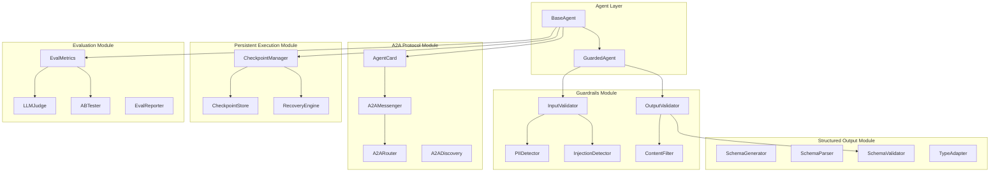
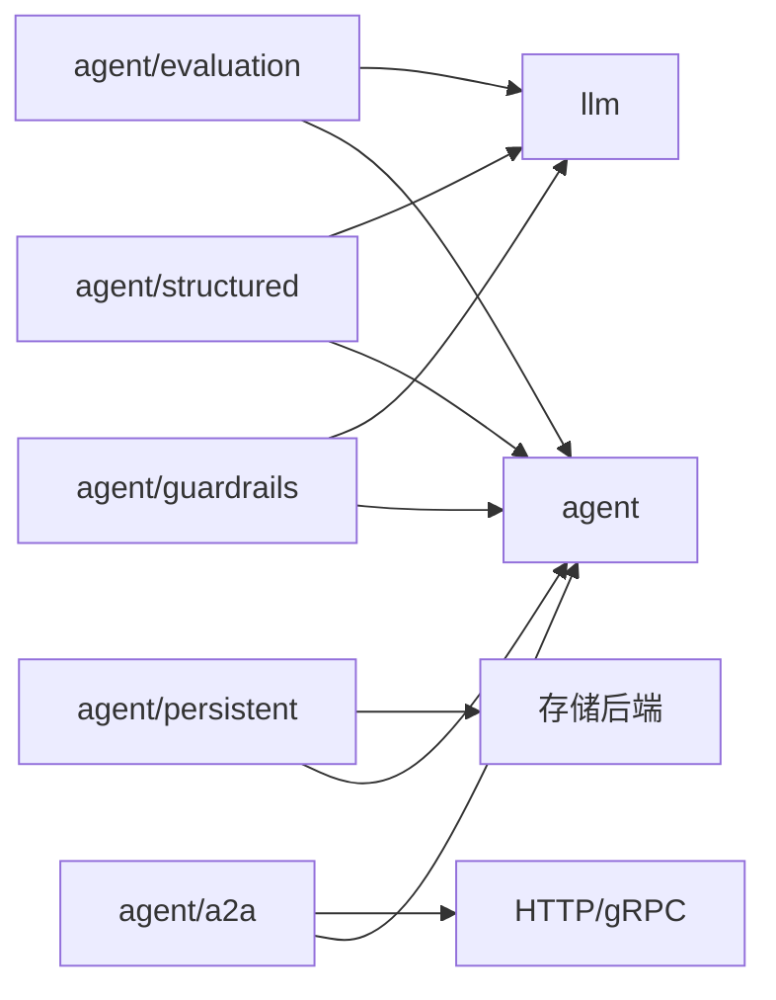
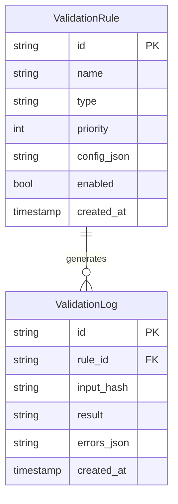
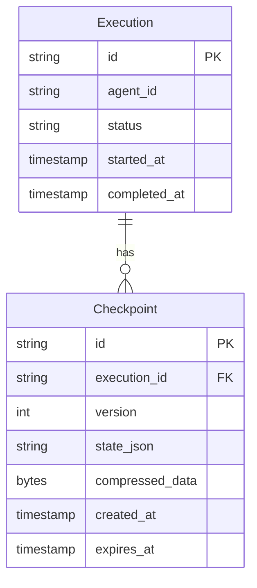
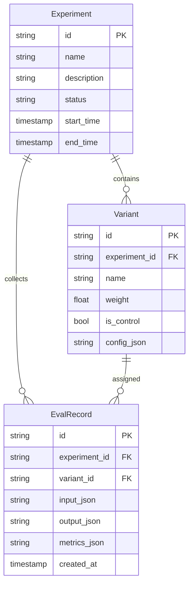
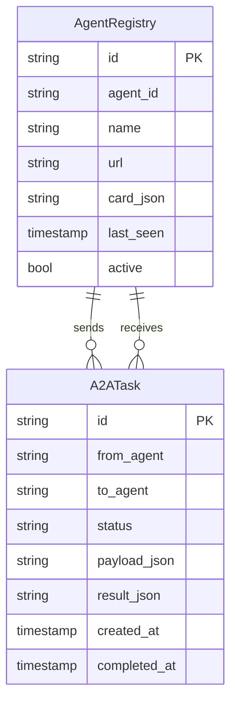

# 设计文档

## 概述

本设计文档描述 AgentFlow 框架 2026 年增强功能的技术架构和实现方案。增强功能分为五个核心模块：

1. **Guardrails（安全护栏）** - 输入/输出验证、内容过滤、PII 检测、提示注入防护
2. **Structured Output（结构化输出）** - 类型安全输出、JSON Schema 验证、泛型 API
3. **A2A Protocol（Agent-to-Agent 协议）** - 跨系统 Agent 互操作、Agent Card、标准消息交换
4. **Persistent Execution（持久化执行）** - 状态持久化、检查点管理、故障恢复
5. **Evaluation Framework（评估框架）** - 自动化评估、LLM-as-Judge、A/B 测试

## 架构

### 整体架构图



### 模块依赖关系




## 组件与接口

### 1. Guardrails 模块 (`agent/guardrails/`)

#### 核心接口

```go
// Validator 验证器接口
type Validator interface {
    // Validate 执行验证，返回验证结果
    Validate(ctx context.Context, content string) (*ValidationResult, error)
    // Name 返回验证器名称
    Name() string
    // Priority 返回优先级（数字越小优先级越高）
    Priority() int
}

// ValidationResult 验证结果
type ValidationResult struct {
    Valid    bool              `json:"valid"`
    Errors   []ValidationError `json:"errors,omitempty"`
    Warnings []string          `json:"warnings,omitempty"`
    Metadata map[string]any    `json:"metadata,omitempty"`
}

// ValidationError 验证错误
type ValidationError struct {
    Code     string `json:"code"`
    Message  string `json:"message"`
    Severity string `json:"severity"` // critical, high, medium, low
    Field    string `json:"field,omitempty"`
}

// Filter 过滤器接口
type Filter interface {
    // Filter 执行过滤，返回过滤后的内容
    Filter(ctx context.Context, content string) (string, error)
    // Name 返回过滤器名称
    Name() string
}

// GuardrailsConfig 护栏配置
type GuardrailsConfig struct {
    InputValidators  []Validator `json:"-"`
    OutputValidators []Validator `json:"-"`
    OutputFilters    []Filter    `json:"-"`
    
    // 内置验证器配置
    MaxInputLength      int      `json:"max_input_length"`
    BlockedKeywords     []string `json:"blocked_keywords"`
    PIIDetectionEnabled bool     `json:"pii_detection_enabled"`
    InjectionDetection  bool     `json:"injection_detection"`
    
    // 失败处理
    OnInputFailure  FailureAction `json:"on_input_failure"`
    OnOutputFailure FailureAction `json:"on_output_failure"`
    MaxRetries      int           `json:"max_retries"`
}

type FailureAction string

const (
    FailureActionReject FailureAction = "reject"
    FailureActionWarn   FailureAction = "warn"
    FailureActionRetry  FailureAction = "retry"
)
```

#### 内置验证器

```go
// PIIDetector PII 检测器
type PIIDetector struct {
    patterns map[PIIType]*regexp.Regexp
    action   PIIAction // mask, reject, warn
}

type PIIType string

const (
    PIITypePhone    PIIType = "phone"
    PIITypeEmail    PIIType = "email"
    PIITypeIDCard   PIIType = "id_card"
    PIITypeBankCard PIIType = "bank_card"
    PIITypeAddress  PIIType = "address"
)

type PIIAction string

const (
    PIIActionMask   PIIAction = "mask"
    PIIActionReject PIIAction = "reject"
    PIIActionWarn   PIIAction = "warn"
)

// InjectionDetector 提示注入检测器
type InjectionDetector struct {
    patterns       []string
    caseSensitive  bool
    useDelimiters  bool
}

// ContentFilter 内容过滤器
type ContentFilter struct {
    blockedPatterns []*regexp.Regexp
    replacement     string
}
```

### 2. Structured Output 模块 (`agent/structured/`)

#### 核心接口

```go
// StructuredOutput 结构化输出处理器
type StructuredOutput[T any] struct {
    schema     *JSONSchema
    provider   llm.Provider
    validator  SchemaValidator
}

// NewStructuredOutput 创建结构化输出处理器
func NewStructuredOutput[T any](provider llm.Provider) (*StructuredOutput[T], error)

// Generate 生成结构化输出
func (s *StructuredOutput[T]) Generate(ctx context.Context, prompt string) (*T, error)

// GenerateWithMessages 从消息生成结构化输出
func (s *StructuredOutput[T]) GenerateWithMessages(ctx context.Context, messages []llm.Message) (*T, error)

// JSONSchema JSON Schema 定义
type JSONSchema struct {
    Type        string                 `json:"type"`
    Properties  map[string]*JSONSchema `json:"properties,omitempty"`
    Required    []string               `json:"required,omitempty"`
    Items       *JSONSchema            `json:"items,omitempty"`
    Enum        []any                  `json:"enum,omitempty"`
    Description string                 `json:"description,omitempty"`
    Default     any                    `json:"default,omitempty"`
}

// SchemaGenerator 从 Go 类型生成 Schema
type SchemaGenerator struct{}

// GenerateSchema 从类型生成 JSON Schema
func (g *SchemaGenerator) GenerateSchema(t reflect.Type) (*JSONSchema, error)

// SchemaValidator Schema 验证器
type SchemaValidator interface {
    Validate(data []byte, schema *JSONSchema) error
}

// ParseResult 解析结果
type ParseResult[T any] struct {
    Value  *T
    Raw    string
    Errors []ParseError
}

type ParseError struct {
    Path    string `json:"path"`
    Message string `json:"message"`
}
```

#### 结构体标签支持

```go
// 示例结构体定义
type TaskResult struct {
    Status      string   `json:"status" jsonschema:"enum=success,failure,pending"`
    Message     string   `json:"message" jsonschema:"required"`
    Score       float64  `json:"score" jsonschema:"minimum=0,maximum=100"`
    Tags        []string `json:"tags" jsonschema:"minItems=1"`
    CompletedAt *string  `json:"completed_at,omitempty"`
}
```

### 3. A2A Protocol 模块 (`agent/a2a/`)

#### Agent Card

```go
// AgentCard A2A Agent Card 定义
type AgentCard struct {
    Name         string            `json:"name"`
    Description  string            `json:"description"`
    URL          string            `json:"url"`
    Version      string            `json:"version"`
    Capabilities []Capability      `json:"capabilities"`
    InputSchema  *JSONSchema       `json:"input_schema,omitempty"`
    OutputSchema *JSONSchema       `json:"output_schema,omitempty"`
    Tools        []ToolDefinition  `json:"tools,omitempty"`
    Metadata     map[string]string `json:"metadata,omitempty"`
}

// Capability Agent 能力定义
type Capability struct {
    Name        string `json:"name"`
    Description string `json:"description"`
    Type        string `json:"type"` // task, query, stream
}

// ToolDefinition 工具定义
type ToolDefinition struct {
    Name        string      `json:"name"`
    Description string      `json:"description"`
    Parameters  *JSONSchema `json:"parameters"`
}

// AgentCardGenerator Agent Card 生成器
type AgentCardGenerator struct{}

// Generate 从 Agent 配置生成 Agent Card
func (g *AgentCardGenerator) Generate(agent agent.Agent, baseURL string) *AgentCard
```

#### A2A 消息交换

```go
// A2AMessage A2A 标准消息
type A2AMessage struct {
    ID        string         `json:"id"`
    Type      A2AMessageType `json:"type"`
    From      string         `json:"from"`
    To        string         `json:"to"`
    Payload   any            `json:"payload"`
    Timestamp time.Time      `json:"timestamp"`
    ReplyTo   string         `json:"reply_to,omitempty"`
}

type A2AMessageType string

const (
    A2AMessageTypeTask     A2AMessageType = "task"
    A2AMessageTypeResult   A2AMessageType = "result"
    A2AMessageTypeError    A2AMessageType = "error"
    A2AMessageTypeStatus   A2AMessageType = "status"
    A2AMessageTypeCancel   A2AMessageType = "cancel"
)

// A2AClient A2A 客户端
type A2AClient interface {
    // Discover 发现远程 Agent
    Discover(ctx context.Context, url string) (*AgentCard, error)
    // Send 发送消息（同步）
    Send(ctx context.Context, msg *A2AMessage) (*A2AMessage, error)
    // SendAsync 发送消息（异步）
    SendAsync(ctx context.Context, msg *A2AMessage) (string, error)
    // GetResult 获取异步结果
    GetResult(ctx context.Context, taskID string) (*A2AMessage, error)
}

// A2AServer A2A 服务端
type A2AServer interface {
    // RegisterAgent 注册本地 Agent
    RegisterAgent(agent agent.Agent) error
    // ServeHTTP 提供 HTTP 服务
    ServeHTTP(w http.ResponseWriter, r *http.Request)
    // GetAgentCard 获取 Agent Card
    GetAgentCard(agentID string) (*AgentCard, error)
}
```

### 4. Persistent Execution 模块 (`agent/persistent/`)

#### 检查点管理

```go
// Checkpoint 检查点数据
type Checkpoint struct {
    ID           string         `json:"id"`
    ExecutionID  string         `json:"execution_id"`
    AgentID      string         `json:"agent_id"`
    Version      int            `json:"version"`
    State        ExecutionState `json:"state"`
    CurrentStep  int            `json:"current_step"`
    TotalSteps   int            `json:"total_steps"`
    Context      map[string]any `json:"context"`
    Messages     []llm.Message  `json:"messages"`
    ToolHistory  []ToolCall     `json:"tool_history"`
    CreatedAt    time.Time      `json:"created_at"`
    ExpiresAt    time.Time      `json:"expires_at"`
}

type ExecutionState string

const (
    ExecutionStatePending   ExecutionState = "pending"
    ExecutionStateRunning   ExecutionState = "running"
    ExecutionStatePaused    ExecutionState = "paused"
    ExecutionStateCompleted ExecutionState = "completed"
    ExecutionStateFailed    ExecutionState = "failed"
)

// ToolCall 工具调用记录
type ToolCall struct {
    ID        string          `json:"id"`
    Name      string          `json:"name"`
    Arguments json.RawMessage `json:"arguments"`
    Result    json.RawMessage `json:"result"`
    Error     string          `json:"error,omitempty"`
    Duration  time.Duration   `json:"duration"`
    Timestamp time.Time       `json:"timestamp"`
}

// CheckpointStore 检查点存储接口
type CheckpointStore interface {
    // Save 保存检查点
    Save(ctx context.Context, cp *Checkpoint) error
    // Load 加载检查点
    Load(ctx context.Context, executionID string) (*Checkpoint, error)
    // LoadVersion 加载指定版本
    LoadVersion(ctx context.Context, executionID string, version int) (*Checkpoint, error)
    // List 列出执行的所有检查点
    List(ctx context.Context, executionID string) ([]*Checkpoint, error)
    // Delete 删除检查点
    Delete(ctx context.Context, checkpointID string) error
    // Cleanup 清理过期检查点
    Cleanup(ctx context.Context, before time.Time) (int, error)
}

// CheckpointManager 检查点管理器
type CheckpointManager struct {
    store    CheckpointStore
    config   CheckpointConfig
    logger   *zap.Logger
}

// CheckpointConfig 检查点配置
type CheckpointConfig struct {
    Enabled         bool          `json:"enabled"`
    Interval        time.Duration `json:"interval"`
    MaxVersions     int           `json:"max_versions"`
    TTL             time.Duration `json:"ttl"`
    SaveOnToolCall  bool          `json:"save_on_tool_call"`
    SaveOnStepEnd   bool          `json:"save_on_step_end"`
}

// NewCheckpointManager 创建检查点管理器
func NewCheckpointManager(store CheckpointStore, config CheckpointConfig, logger *zap.Logger) *CheckpointManager

// CreateCheckpoint 创建检查点
func (m *CheckpointManager) CreateCheckpoint(ctx context.Context, exec *Execution) (*Checkpoint, error)

// Recover 从检查点恢复执行
func (m *CheckpointManager) Recover(ctx context.Context, executionID string) (*Execution, error)

// RecoverFromVersion 从指定版本恢复
func (m *CheckpointManager) RecoverFromVersion(ctx context.Context, executionID string, version int) (*Execution, error)
```

#### 存储后端实现

```go
// MemoryCheckpointStore 内存存储（测试用）
type MemoryCheckpointStore struct {
    checkpoints map[string][]*Checkpoint
    mu          sync.RWMutex
}

// FileCheckpointStore 文件存储
type FileCheckpointStore struct {
    baseDir string
}

// RedisCheckpointStore Redis 存储
type RedisCheckpointStore struct {
    client *redis.Client
    prefix string
}

// PostgresCheckpointStore PostgreSQL 存储
type PostgresCheckpointStore struct {
    db *gorm.DB
}
```

### 5. Evaluation 模块 (`agent/evaluation/`)

#### 评估指标

```go
// Metric 评估指标接口
type Metric interface {
    // Name 指标名称
    Name() string
    // Compute 计算指标值
    Compute(ctx context.Context, input *EvalInput, output *EvalOutput) (float64, error)
}

// EvalInput 评估输入
type EvalInput struct {
    Prompt    string         `json:"prompt"`
    Context   map[string]any `json:"context,omitempty"`
    Expected  string         `json:"expected,omitempty"`
    Reference string         `json:"reference,omitempty"`
}

// EvalOutput 评估输出
type EvalOutput struct {
    Response   string        `json:"response"`
    TokensUsed int           `json:"tokens_used"`
    Latency    time.Duration `json:"latency"`
    Cost       float64       `json:"cost"`
    Metadata   map[string]any `json:"metadata,omitempty"`
}

// EvalResult 评估结果
type EvalResult struct {
    InputID    string             `json:"input_id"`
    Metrics    map[string]float64 `json:"metrics"`
    Passed     bool               `json:"passed"`
    Errors     []string           `json:"errors,omitempty"`
    Timestamp  time.Time          `json:"timestamp"`
}

// 内置指标
type AccuracyMetric struct{}      // 准确率
type LatencyMetric struct{}       // 延迟
type TokenUsageMetric struct{}    // Token 使用量
type CostMetric struct{}          // 成本
type RelevanceMetric struct{}     // 相关性（需要 LLM）
```

#### LLM-as-Judge

```go
// LLMJudge LLM 评判器
type LLMJudge struct {
    provider   llm.Provider
    config     LLMJudgeConfig
    logger     *zap.Logger
}

// LLMJudgeConfig LLM 评判配置
type LLMJudgeConfig struct {
    Model           string            `json:"model"`
    Dimensions      []JudgeDimension  `json:"dimensions"`
    PromptTemplate  string            `json:"prompt_template"`
    ScoreRange      [2]float64        `json:"score_range"` // [min, max]
    RequireReasoning bool             `json:"require_reasoning"`
}

// JudgeDimension 评判维度
type JudgeDimension struct {
    Name        string  `json:"name"`
    Description string  `json:"description"`
    Weight      float64 `json:"weight"`
}

// JudgeResult 评判结果
type JudgeResult struct {
    OverallScore float64                   `json:"overall_score"`
    Dimensions   map[string]DimensionScore `json:"dimensions"`
    Reasoning    string                    `json:"reasoning"`
    Confidence   float64                   `json:"confidence"`
}

type DimensionScore struct {
    Score     float64 `json:"score"`
    Reasoning string  `json:"reasoning"`
}

// NewLLMJudge 创建 LLM 评判器
func NewLLMJudge(provider llm.Provider, config LLMJudgeConfig, logger *zap.Logger) *LLMJudge

// Judge 执行评判
func (j *LLMJudge) Judge(ctx context.Context, input *EvalInput, output *EvalOutput) (*JudgeResult, error)

// JudgeBatch 批量评判
func (j *LLMJudge) JudgeBatch(ctx context.Context, pairs []InputOutputPair) ([]*JudgeResult, error)
```

#### A/B 测试

```go
// ABTester A/B 测试器
type ABTester struct {
    experiments map[string]*Experiment
    store       ExperimentStore
    logger      *zap.Logger
}

// Experiment 实验定义
type Experiment struct {
    ID          string              `json:"id"`
    Name        string              `json:"name"`
    Description string              `json:"description"`
    Variants    []Variant           `json:"variants"`
    Metrics     []string            `json:"metrics"`
    StartTime   time.Time           `json:"start_time"`
    EndTime     *time.Time          `json:"end_time,omitempty"`
    Status      ExperimentStatus    `json:"status"`
}

type ExperimentStatus string

const (
    ExperimentStatusDraft    ExperimentStatus = "draft"
    ExperimentStatusRunning  ExperimentStatus = "running"
    ExperimentStatusPaused   ExperimentStatus = "paused"
    ExperimentStatusComplete ExperimentStatus = "completed"
)

// Variant 实验变体
type Variant struct {
    ID         string         `json:"id"`
    Name       string         `json:"name"`
    Config     map[string]any `json:"config"`
    Weight     float64        `json:"weight"` // 流量权重
    IsControl  bool           `json:"is_control"`
}

// ExperimentResult 实验结果
type ExperimentResult struct {
    ExperimentID    string                    `json:"experiment_id"`
    VariantResults  map[string]*VariantResult `json:"variant_results"`
    Winner          string                    `json:"winner,omitempty"`
    Confidence      float64                   `json:"confidence"`
    SampleSize      int                       `json:"sample_size"`
    Duration        time.Duration             `json:"duration"`
}

type VariantResult struct {
    VariantID   string             `json:"variant_id"`
    SampleCount int                `json:"sample_count"`
    Metrics     map[string]float64 `json:"metrics"`
    StdDev      map[string]float64 `json:"std_dev"`
}

// NewABTester 创建 A/B 测试器
func NewABTester(store ExperimentStore, logger *zap.Logger) *ABTester

// CreateExperiment 创建实验
func (t *ABTester) CreateExperiment(exp *Experiment) error

// Assign 分配变体
func (t *ABTester) Assign(experimentID, userID string) (*Variant, error)

// RecordResult 记录结果
func (t *ABTester) RecordResult(experimentID, variantID string, result *EvalResult) error

// Analyze 分析实验结果
func (t *ABTester) Analyze(ctx context.Context, experimentID string) (*ExperimentResult, error)
```


## 数据模型

### Guardrails 数据模型



### Checkpoint 数据模型



### Evaluation 数据模型



### A2A 数据模型




## 正确性属性

*正确性属性是系统在所有有效执行中应保持为真的特征或行为——本质上是关于系统应该做什么的形式化陈述。属性作为人类可读规范和机器可验证正确性保证之间的桥梁。*

### Property 1: 输入验证检测

*For any* 包含已知注入模式、PII 数据或禁止关键词的输入字符串，当通过 InputValidator 验证时，验证结果的 Valid 字段应为 false，且 Errors 列表应包含对应的错误代码。

**Validates: Requirements 1.1, 1.2, 1.4**

### Property 2: 输入长度限制

*For any* 超过配置最大长度的输入字符串，当通过配置了长度限制的 InputValidator 验证时，系统应截断输入至最大长度或返回长度超限错误。

**Validates: Requirements 1.3**

### Property 3: 验证器优先级执行顺序

*For any* 配置了多个验证器的 GuardrailsConfig，当执行验证时，验证器应按 Priority() 返回值从小到大的顺序执行，且执行顺序可通过验证日志验证。

**Validates: Requirements 1.5**

### Property 4: 验证错误信息完整性

*For any* 验证失败的输入，返回的 ValidationResult 应包含非空的 Errors 列表，每个 ValidationError 应包含 Code、Message 和 Severity 字段。

**Validates: Requirements 1.6**

### Property 5: 输出敏感信息脱敏

*For any* 包含 PII 数据的输出字符串，当通过配置了脱敏的 OutputValidator 处理后，返回的字符串不应包含原始 PII 数据，而应包含脱敏后的占位符。

**Validates: Requirements 2.1**

### Property 6: 输出验证失败日志记录

*For any* 验证失败的输出，系统应记录包含时间戳、错误类型、输入哈希的审计日志条目。

**Validates: Requirements 2.5**

### Property 7: Schema 生成与解析 Round-Trip

*For any* 有效的 Go 结构体类型 T，从 T 生成 JSON Schema，然后使用该 Schema 验证 T 的有效 JSON 实例，验证应通过；将该 JSON 解析回 T 类型，应得到等价的值。

**Validates: Requirements 3.1, 3.5, 3.6, 4.1, 4.3**

### Property 8: Schema 验证错误定位

*For any* 不符合 Schema 的 JSON 输出，验证错误应包含具体的违规字段路径（JSON Path 格式）和违规原因。

**Validates: Requirements 3.2**

### Property 9: Agent Card 完整性

*For any* 注册的 Agent，生成的 AgentCard 应包含非空的 Name、Description、URL、Version 字段，且 Capabilities 列表应反映 Agent 的实际能力。

**Validates: Requirements 5.1, 5.2, 5.3**

### Property 10: A2A 消息 Round-Trip

*For any* 有效的 A2AMessage，序列化为 JSON 后再反序列化，应得到等价的消息对象，所有字段值保持不变。

**Validates: Requirements 6.1**

### Property 11: A2A 任务路由正确性

*For any* 发送到已注册 Agent 的 A2A 任务请求，系统应将请求路由到对应的本地 Agent，且 Agent 的 Execute 方法应被调用。

**Validates: Requirements 6.2**

### Property 12: 检查点 Round-Trip

*For any* 有效的 Checkpoint 对象，保存到 CheckpointStore 后再加载，应得到等价的 Checkpoint 对象，所有字段值保持不变。

**Validates: Requirements 7.3, 8.1, 8.2**

### Property 13: 检查点版本管理

*For any* 执行 ID，当保存的检查点数量超过 MaxVersions 配置时，系统应自动删除最旧的检查点，保留的检查点数量应等于 MaxVersions。

**Validates: Requirements 7.6**

### Property 14: 检查点恢复步骤跳过

*For any* 从检查点恢复的执行，已完成的步骤（CurrentStep 之前的步骤）不应被重新执行，执行应从 CurrentStep 继续。

**Validates: Requirements 8.5**

### Property 15: 评估指标收集完整性

*For any* 配置了评估指标的 Agent 执行，执行完成后收集的 EvalResult 应包含所有配置指标的值，且值类型正确。

**Validates: Requirements 9.1, 9.2**

### Property 16: LLM-as-Judge 结果结构

*For any* LLM-as-Judge 评估执行，返回的 JudgeResult 应包含 OverallScore（在配置的 ScoreRange 内）、所有配置维度的 DimensionScore、以及非空的 Reasoning。

**Validates: Requirements 10.1, 10.3, 10.4**

### Property 17: A/B 测试流量分配

*For any* 配置了多个 Variant 的实验，经过足够多次分配后，各 Variant 的实际分配比例应接近配置的 Weight 比例（在统计误差范围内）。

**Validates: Requirements 11.2**

### Property 18: A/B 测试统计分析

*For any* 完成的实验，生成的 ExperimentResult 应包含所有 Variant 的 VariantResult，每个 VariantResult 应包含 SampleCount、Metrics 和 StdDev。

**Validates: Requirements 11.3, 11.4**

## 错误处理

### 错误类型定义

```go
// guardrails 错误
var (
    ErrValidationFailed    = errors.New("validation failed")
    ErrInjectionDetected   = errors.New("prompt injection detected")
    ErrPIIDetected         = errors.New("PII detected")
    ErrContentBlocked      = errors.New("content blocked")
    ErrMaxLengthExceeded   = errors.New("max length exceeded")
)

// structured output 错误
var (
    ErrSchemaValidation    = errors.New("schema validation failed")
    ErrParseFailed         = errors.New("parse failed")
    ErrMissingRequired     = errors.New("missing required field")
    ErrInvalidType         = errors.New("invalid type")
)

// a2a 错误
var (
    ErrAgentNotFound       = errors.New("agent not found")
    ErrRemoteUnavailable   = errors.New("remote agent unavailable")
    ErrAuthFailed          = errors.New("authentication failed")
    ErrInvalidMessage      = errors.New("invalid message format")
)

// persistent execution 错误
var (
    ErrCheckpointNotFound  = errors.New("checkpoint not found")
    ErrCheckpointCorrupted = errors.New("checkpoint corrupted")
    ErrRecoveryFailed      = errors.New("recovery failed")
    ErrStorageUnavailable  = errors.New("storage unavailable")
)

// evaluation 错误
var (
    ErrExperimentNotFound  = errors.New("experiment not found")
    ErrInvalidMetric       = errors.New("invalid metric")
    ErrEvaluationFailed    = errors.New("evaluation failed")
)
```

### 错误处理策略

| 模块 | 错误类型 | 处理策略 |
|------|----------|----------|
| Guardrails | 验证失败 | 返回详细错误，可配置重试 |
| Guardrails | 注入检测 | 立即拒绝，记录审计日志 |
| Structured Output | Schema 验证失败 | 返回字段级错误，可配置重试 |
| A2A | 远程不可用 | 返回标准错误，支持重试 |
| Persistent | 存储失败 | 记录错误，继续执行 |
| Evaluation | 评估失败 | 记录错误，返回部分结果 |


## 测试策略

### 测试框架

- **单元测试**: 使用 `testify/assert` 和 `testify/mock`
- **属性测试**: 使用 `gopter` 或 `rapid` 进行属性基测试
- **集成测试**: 使用 `testcontainers-go` 进行存储后端测试

### 属性测试配置

```go
// 属性测试最小迭代次数
const MinPropertyTestIterations = 100

// 示例属性测试
func TestSchemaRoundTrip(t *testing.T) {
    // Feature: agent-framework-2026-enhancements, Property 7: Schema 生成与解析 Round-Trip
    rapid.Check(t, func(t *rapid.T) {
        // 生成随机结构体实例
        instance := generateRandomInstance(t)
        
        // 生成 Schema
        schema, err := generator.GenerateSchema(reflect.TypeOf(instance))
        require.NoError(t, err)
        
        // 序列化
        data, err := json.Marshal(instance)
        require.NoError(t, err)
        
        // 验证
        err = validator.Validate(data, schema)
        require.NoError(t, err)
        
        // 反序列化
        var result TestStruct
        err = json.Unmarshal(data, &result)
        require.NoError(t, err)
        
        // 验证等价性
        assert.Equal(t, instance, result)
    })
}
```

### 测试覆盖要求

| 模块 | 单元测试 | 属性测试 | 集成测试 |
|------|----------|----------|----------|
| Guardrails | 验证器逻辑 | P1-P6 | - |
| Structured Output | 解析逻辑 | P7-P8 | - |
| A2A Protocol | 消息处理 | P9-P11 | HTTP 端点 |
| Persistent Execution | 检查点管理 | P12-P14 | 存储后端 |
| Evaluation | 指标计算 | P15-P18 | - |

### 测试数据生成

```go
// 输入验证测试数据生成器
func GenerateInjectionInput() *rapid.Generator[string] {
    patterns := []string{
        "ignore previous instructions",
        "忽略之前的指令",
        "system: new instructions",
    }
    return rapid.Custom(func(t *rapid.T) string {
        prefix := rapid.String().Draw(t, "prefix")
        pattern := rapid.SampledFrom(patterns).Draw(t, "pattern")
        suffix := rapid.String().Draw(t, "suffix")
        return prefix + pattern + suffix
    })
}

// PII 测试数据生成器
func GeneratePIIInput() *rapid.Generator[string] {
    return rapid.Custom(func(t *rapid.T) string {
        text := rapid.String().Draw(t, "text")
        phone := fmt.Sprintf("1%d", rapid.Int64Range(3000000000, 9999999999).Draw(t, "phone"))
        return text + " " + phone
    })
}
```
