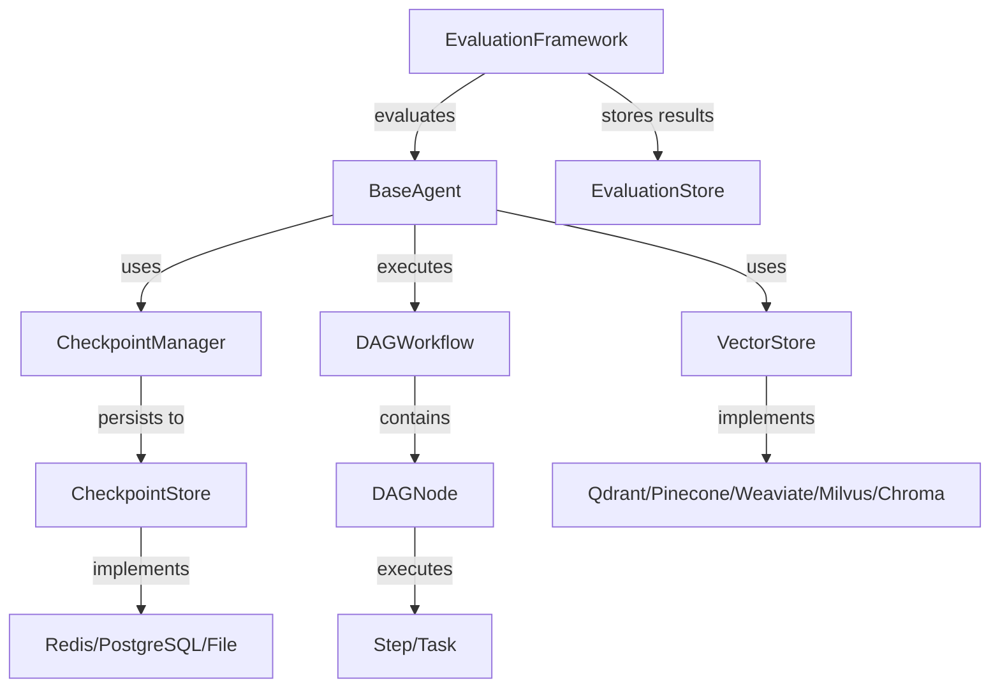

─────────────────────────────────────────────┐
│                  Storage Layer                               │
│  ┌──────────────┐  ┌──────────────┐  ┌──────────────┐     │
│  │  Redis       │  │  PostgreSQL  │  │  Vector DBs  │     │
│  │  (Checkpoint)│  │  (Checkpoint)│  │  (Memory)    │     │
│  └──────────────┘  └──────────────┘  └──────────────┘     │
└─────────────────────────────────────────────────────────────┘
```

### Component Interaction



## Components and Interfaces

### 1. Complete Checkpoint System

#### Core Interfaces

```go
// CheckpointStore interface (already exists, enhance it)
type CheckpointStore interface {
    Save(ctx context.Context, checkpoint *Checkpoint) error
    Load(ctx context.Context, checkpointID string) (*Checkpoint, error)
    LoadLatest(ctx context.Context, threadID string) (*Checkpoint, error)
    List(ctx context.Context, threadID string, limit int) ([]*Checkpoint, error)
    Delete(ctx context.Context, checkpointID string) error
    DeleteThread(ctx context.Context, threadID string) error
    
    // NEW: Versioning support
    LoadVersion(ctx context.Context, threadID string, version int) (*Checkpoint, error)
    ListVersions(ctx context.Context, threadID string) ([]CheckpointVersion, error)
    Rollback(ctx context.Context, threadID string, version int) error
}

// CheckpointVersion metadata
type CheckpointVersion struct {
    Version   int       `json:"version"`
    ID        string    `json:"id"`
    CreatedAt time.Time `json:"created_at"`
    State     State     `json:"state"`
    Summary   string    `json:"summary"`
}
```

#### File-Based Checkpoint Store

```go
// FileCheckpointStore for local development and testing
type FileCheckpointStore struct {
    basePath string
    logger   *zap.Logger
    mu       sync.RWMutex
}

// File structure:
// {basePath}/
//   threads/
//     {threadID}/
//       checkpoints/
//         {checkpointID}.json
//       versions.json
//       latest.txt
```

#### Enhanced Checkpoint Manager

```go
type CheckpointManager struct {
    store  CheckpointStore
    logger *zap.Logger
    
    // NEW: Automatic checkpointing
    autoSaveInterval time.Duration
    autoSaveEnabled  bool
}

// NEW methods
func (m *CheckpointManager) EnableAutoSave(interval time.Duration)
func (m *CheckpointManager) CreateCheckpoint(ctx context.Context, agent Agent) (*Checkpoint, error)
func (m *CheckpointManager) RollbackToVersion(ctx context.Context, agent Agent, version int) error
```

### 2. Graph-based Workflow Orchestration (DAG)

#### Core Interfaces

```go
// DAGWorkflow represents a directed acyclic graph workflow
type DAGWorkflow struct {
    name        string
    description string
    graph       *DAGGraph
    executor    *DAGExecutor
    logger      *zap.Logger
}

// DAGGraph represents the workflow structure
type DAGGraph struct {
    nodes map[string]*DAGNode
    edges map[string][]string  // node_id -> [dependent_node_ids]
    entry string                // entry node ID
}

// DAGNode represents a single node in the workflow
type DAGNode struct {
    ID          string
    Type        NodeType
    Step        Step              // for action nodes
    Condition   ConditionFunc     // for conditional nodes
    LoopConfig  *LoopConfig       // for loop nodes
    SubGraph    *DAGGraph         // for sub-graph nodes
    Metadata    map[string]any
}

// NodeType defines node types
type NodeType string

const (
    NodeTypeAction      NodeType = "action"       // Execute a step
    NodeTypeCondition   NodeType = "condition"    // Conditional branching
    NodeTypeLoop        NodeType = "loop"         // Loop iteration
    NodeTypeParallel    NodeType = "parallel"     // Parallel execution
    NodeTypeSubGraph    NodeType = "subgraph"     // Nested workflow
    NodeTypeCheckpoint  NodeType = "checkpoint"   // Checkpoint node
)

// ConditionFunc evaluates a condition
type ConditionFunc func(ctx context.Context, input interface{}) (bool, error)

// LoopConfig defines loop behavior
type LoopConfig struct {
    Type          LoopType
    MaxIterations int
    Condition     ConditionFunc
    Iterator      IteratorFunc
}

type LoopType string

const (
    LoopTypeWhile   LoopType = "while"
    LoopTypeFor     LoopType = "for"
    LoopTypeForEach LoopType = "foreach"
)

type IteratorFunc func(ctx context.Context, input interface{}) ([]interface{}, error)
```

#### DAG Executor

```go
// DAGExecutor executes DAG workflows
type DAGExecutor struct {
    checkpointMgr *CheckpointManager
    logger        *zap.Logger
    
    // Execution state
    executionID   string
    threadID      string
    nodeResults   map[string]interface{}
    visitedNodes  map[string]bool
}

// Execute runs the DAG workflow
func (e *DAGExecutor) Execute(ctx context.Context, graph *DAGGraph, input interface{}) (interface{}, error)

// executeNode executes a single node
func (e *DAGExecutor) executeNode(ctx context.Context, node *DAGNode, input interface{}) (interface{}, error)

// resolveNextNodes determines which nodes to execute next
func (e *DAGExecutor) resolveNextNodes(ctx context.Context, currentNode *DAGNode, result interface{}) ([]*DAGNode, error)
```

#### DAG Builder (Fluent API)

```go
// DAGBuilder provides fluent API for building workflows
type DAGBuilder struct {
    graph  *DAGGraph
    logger *zap.Logger
}

func NewDAGBuilder(name string) *DAGBuilder

func (b *DAGBuilder) AddNode(id string, nodeType NodeType) *NodeBuilder
func (b *DAGBuilder) AddEdge(from, to string) *DAGBuilder
func (b *DAGBuilder) SetEntry(nodeID string) *DAGBuilder
func (b *DAGBuilder) Build() (*DAGWorkflow, error)

// NodeBuilder for configuring individual nodes
type NodeBuilder struct {
    node   *DAGNode
    parent *DAGBuilder
}

func (nb *NodeBuilder) WithStep(step Step) *NodeBuilder
func (nb *NodeBuilder) WithCondition(cond ConditionFunc) *NodeBuilder
func (nb *NodeBuilder) WithLoop(config LoopConfig) *NodeBuilder
func (nb *NodeBuilder) Done() *DAGBuilder
```

#### YAML/JSON Configuration

```yaml
# Example DAG workflow definition
name: "data-processing-pipeline"
description: "Process data with conditional branching"
entry: "validate"

nodes:
  - id: "validate"
    type: "action"
    step: "validate_input"
    next: ["check_quality"]
  
  - id: "check_quality"
    type: "condition"
    condition: "quality_threshold"
    on_true: ["process_high_quality"]
    on_false: ["process_low_quality"]
  
  - id: "process_high_quality"
    type: "action"
    step: "advanced_processing"
    next: ["aggregate"]
  
  - id: "process_low_quality"
    type: "action"
    step: "basic_processing"
    next: ["aggregate"]
  
  - id: "aggregate"
    type: "action"
    step: "aggregate_results"
```

### 3. Evaluation Framework

#### Core Interfaces

```go
// EvaluationFramework provides agent evaluation capabilities
type EvaluationFramework struct {
    store      EvaluationStore
    metrics    map[string]Metric
    benchmarks map[string]Benchmark
    logger     *zap.Logger
}

// Metric defines an evaluation metric
type Metric interface {
    Name() string
    Description() string
    Compute(ctx context.Context, predictions, references []interface{}) (float64, error)
}

// Benchmark defines a test suite
type Benchmark interface {
    Name() string
    Description() string
    LoadDataset(ctx context.Context) ([]TestCase, error)
    Evaluate(ctx context.Context, agent Agent) (*BenchmarkResult, error)
}

// TestCase represents a single test case
type TestCase struct {
    ID          string         `json:"id"`
    Input       string         `json:"input"`
    Expected    string         `json:"expected"`
    Metadata    map[string]any `json:"metadata"`
    Category    string         `json:"category"`
}

// EvaluationResult stores evaluation results
type EvaluationResult struct {
    ID          string                 `json:"id"`
    AgentID     string                 `json:"agent_id"`
    AgentConfig Config                 `json:"agent_config"`
    Timestamp   time.Time              `json:"timestamp"`
    Metrics     map[string]float64     `json:"metrics"`
    TestCases   []TestCaseResult       `json:"test_cases"`
    Duration    time.Duration          `json:"duration"`
    Metadata    map[string]interface{} `json:"metadata"`
}

// TestCaseResult stores individual test case result
type TestCaseResult struct {
    TestCaseID string         `json:"test_case_id"`
    Input      string         `json:"input"`
    Expected   string         `json:"expected"`
    Actual     string         `json:"actual"`
    Passed     bool           `json:"passed"`
    Score      float64        `json:"score"`
    Duration   time.Duration  `json:"duration"`
    Error      string         `json:"error,omitempty"`
}
```

#### Built-in Metrics

```go
// AccuracyMetric measures exact match accuracy
type AccuracyMetric struct{}

// PrecisionMetric measures precision
type PrecisionMetric struct{}

// RecallMetric measures recall
type RecallMetric struct{}

// F1ScoreMetric measures F1 score
type F1ScoreMetric struct{}

// BLEUMetric measures BLEU score for text generation
type BLEUMetric struct{}

// RougeMetric measures ROUGE score for summarization
type RougeMetric struct{}

// SemanticSimilarityMetric measures semantic similarity using embeddings
type SemanticSimilarityMetric struct {
    embedder Embedder
}
```

#### A/B Testing Support

```go
// ABTest manages A/B testing experiments
type ABTest struct {
    ID          string
    Name        string
    VariantA    Agent
    VariantB    Agent
    SplitRatio  float64  // 0.5 = 50/50 split
    TestCases   []TestCase
    Results     *ABTestResult
}

// ABTestResult stores A/B test results
type ABTestResult struct {
    VariantAResult *EvaluationResult
    VariantBResult *EvaluationResult
    Comparison     *ComparisonReport
    Winner         string  // "A", "B", or "tie"
    Confidence     float64 // statistical confidence
}

// ComparisonReport provides detailed comparison
type ComparisonReport struct {
    MetricComparisons map[string]*MetricComparison
    StatisticalTests  map[string]*StatisticalTest
    Summary           string
}
```

#### Evaluation Store

```go
// EvaluationStore persists evaluation results
type EvaluationStore interface {
    SaveResult(ctx context.Context, result *EvaluationResult) error
    LoadResult(ctx context.Context, id string) (*EvaluationResult, error)
    ListResults(ctx context.Context, agentID string, limit int) ([]*EvaluationResult, error)
    CompareResults(ctx context.Context, ids []string) (*ComparisonReport, error)
    GetTimeSeries(ctx context.Context, agentID string, metric string, from, to time.Time) ([]TimeSeriesPoint, error)
}
```

### 4. Vector Database Integration

#### Unified VectorStore Interface (Enhanced)

```go
// VectorStore interface (enhance existing)
type VectorStore interface {
    // Basic operations
    AddDocuments(ctx context.Context, docs []Document) error
    Search(ctx context.Context, queryEmbedding []float64, topK int) ([]VectorSearchResult, error)
    DeleteDocuments(ctx context.Context, ids []string) error
    UpdateDocument(ctx context.Context, doc Document) error
    Count(ctx context.Context) (int, error)
    
    // NEW: Collection management
    CreateCollection(ctx context.Context, config CollectionConfig) error
    DeleteCollection(ctx context.Context, name string) error
    ListCollections(ctx context.Context) ([]CollectionInfo, error)
    
    // NEW: Hybrid search
    HybridSearch(ctx context.Context, query HybridQuery) ([]VectorSearchResult, error)
    
    // NEW: Batch operations
    BatchAdd(ctx context.Context, docs []Document, batchSize int) error
    BatchDelete(ctx context.Context, ids []string, batchSize int) error
    
    // NEW: Metadata filtering
    SearchWithFilter(ctx context.Context, query VectorQuery) ([]VectorSearchResult, error)
}

// CollectionConfig defines collection settings
type CollectionConfig struct {
    Name           string
    Dimension      int
    DistanceMetric DistanceMetric
    IndexType      IndexType
    Metadata       map[string]any
}

// HybridQuery combines vector and keyword search
type HybridQuery struct {
    VectorQuery   []float64
    KeywordQuery  string
    Filter        map[string]interface{}
    TopK          int
    RerankEnabled bool
}

// VectorQuery with advanced options
type VectorQuery struct {
    Embedding []float64
    Filter    map[string]interface{}
    TopK      int
    Offset    int
    ScoreThreshold float64
}
```

#### Vector Store Implementations

```go
// QdrantVectorStore implementation
type QdrantVectorStore struct {
    client     *qdrant.Client
    collection string
    embedder   Embedder
    logger     *zap.Logger
}

// PineconeVectorStore implementation
type PineconeVectorStore struct {
    client   *pinecone.Client
    index    string
    embedder Embedder
    logger   *zap.Logger
}

// WeaviateVectorStore implementation
type WeaviateVectorStore struct {
    client   *weaviate.Client
    class    string
    embedder Embedder
    logger   *zap.Logger
}

// MilvusVectorStore implementation
type MilvusVectorStore struct {
    client     milvus.Client
    collection string
    embedder   Embedder
    logger     *zap.Logger
}

// ChromaVectorStore implementation
type ChromaVectorStore struct {
    client     *chroma.Client
    collection string
    embedder   Embedder
    logger     *zap.Logger
}
```

#### Embedder Interface

```go
// Embedder generates embeddings
type Embedder interface {
    Embed(ctx context.Context, texts []string) ([][]float64, error)
    EmbedQuery(ctx context.Context, query string) ([]float64, error)
    Dimension() int
}

// OpenAIEmbedder uses OpenAI embeddings
type OpenAIEmbedder struct {
    apiKey string
    model  string
    client *openai.Client
}

// LocalEmbedder uses local embedding models
type LocalEmbedder struct {
    model string
    // Implementation using sentence-transformers or similar
}
```

#### Connection Pool

```go
// VectorStorePool manages connection pooling
type VectorStorePool struct {
    factory    VectorStoreFactory
    pool       chan VectorStore
    maxSize    int
    timeout    time.Duration
    healthCheck time.Duration
    logger     *zap.Logger
}

func NewVectorStorePool(factory VectorStoreFactory, config PoolConfig) *VectorStorePool

func (p *VectorStorePool) Get(ctx context.Context) (VectorStore, error)
func (p *VectorStorePool) Put(store VectorStore) error
func (p *VectorStorePool) Close() error
```

## Data Models

### Checkpoint Data Model

```go
// Checkpoint (enhanced existing structure)
type Checkpoint struct {
    ID        string                 `json:"id"`
    ThreadID  string                 `json:"thread_id"`
    AgentID   string                 `json:"agent_id"`
    Version   int                    `json:"version"`      // NEW
    State     State                  `json:"state"`
    Messages  []CheckpointMessage    `json:"messages"`
    Metadata  map[string]interface{} `json:"metadata"`
    CreatedAt time.Time              `json:"created_at"`
    ParentID  string                 `json:"parent_id,omitempty"`
    
    // NEW: Execution context
    ExecutionContext *ExecutionContext `json:"execution_context,omitempty"`
}

// ExecutionContext captures execution state
type ExecutionContext struct {
    WorkflowID    string                 `json:"workflow_id,omitempty"`
    CurrentNode   string                 `json:"current_node,omitempty"`
    NodeResults   map[string]interface{} `json:"node_results,omitempty"`
    Variables     map[string]interface{} `json:"variables,omitempty"`
}
```

### DAG Workflow Data Model

```go
// DAGDefinition for serialization
type DAGDefinition struct {
    Name        string                 `json:"name" yaml:"name"`
    Description string                 `json:"description" yaml:"description"`
    Entry       string                 `json:"entry" yaml:"entry"`
    Nodes       []NodeDefinition       `json:"nodes" yaml:"nodes"`
    Metadata    map[string]interface{} `json:"metadata,omitempty" yaml:"metadata,omitempty"`
}

// NodeDefinition for serialization
type NodeDefinition struct {
    ID         string                 `json:"id" yaml:"id"`
    Type       string                 `json:"type" yaml:"type"`
    Step       string                 `json:"step,omitempty" yaml:"step,omitempty"`
    Condition  string                 `json:"condition,omitempty" yaml:"condition,omitempty"`
    Next       []string               `json:"next,omitempty" yaml:"next,omitempty"`
    OnTrue     []string               `json:"on_true,omitempty" yaml:"on_true,omitempty"`
    OnFalse    []string               `json:"on_false,omitempty" yaml:"on_false,omitempty"`
    Loop       *LoopDefinition        `json:"loop,omitempty" yaml:"loop,omitempty"`
    SubGraph   *DAGDefinition         `json:"subgraph,omitempty" yaml:"subgraph,omitempty"`
    Metadata   map[string]interface{} `json:"metadata,omitempty" yaml:"metadata,omitempty"`
}

// LoopDefinition for serialization
type LoopDefinition struct {
    Type          string `json:"type" yaml:"type"`
    MaxIterations int    `json:"max_iterations" yaml:"max_iterations"`
    Condition     string `json:"condition,omitempty" yaml:"condition,omitempty"`
}
```

### Evaluation Data Model

```go
// Dataset for evaluation
type Dataset struct {
    ID          string      `json:"id"`
    Name        string      `json:"name"`
    Version     string      `json:"version"`
    Description string      `json:"description"`
    TestCases   []TestCase  `json:"test_cases"`
    CreatedAt   time.Time   `json:"created_at"`
    UpdatedAt   time.Time   `json:"updated_at"`
    Metadata    map[string]any `json:"metadata"`
}
```

## Correctness Properties

*A property is a characteristic or behavior that should hold true across all valid executions of a system—essentially, a formal statement about what the system should do. Properties serve as the bridge between human-readable specifications and machine-verifiable correctness guarantees.*


### Checkpoint System Properties

**Property 1: Checkpoint Round-Trip Consistency**
*For any* agent state with messages, tool calls, and metadata, saving it as a checkpoint then loading it back should produce an equivalent state with all fields preserved.
**Validates: Requirements 1.1, 1.4**

**Property 2: Checkpoint ID and Timestamp Assignment**
*For any* checkpoint save operation, the returned checkpoint should have a non-empty unique ID and a valid timestamp.
**Validates: Requirements 1.2**

**Property 3: Checkpoint Recovery After Interruption**
*For any* agent state saved as a checkpoint, creating a new agent instance and restoring from that checkpoint should result in the same state.
**Validates: Requirements 1.3**

**Property 4: Checkpoint Listing Order**
*For any* sequence of checkpoints saved to a thread, listing them should return them ordered by timestamp in descending order (newest first).
**Validates: Requirements 1.5**

**Property 5: Parent-Child Relationship Preservation**
*For any* checkpoint with a parent checkpoint ID, loading the checkpoint should preserve the parent ID, allowing traversal of the checkpoint chain.
**Validates: Requirements 1.7**

**Property 6: Thread Deletion Completeness**
*For any* thread with associated checkpoints, after deleting the thread, listing checkpoints for that thread should return an empty list.
**Validates: Requirements 1.8**

**Property 7: Sequential Version Numbering**
*For any* sequence of checkpoints saved to a thread, version numbers should be sequential, starting from 1 and incrementing by 1 for each new checkpoint.
**Validates: Requirements 1.10, 5.1**

**Property 8: Version History Completeness**
*For any* thread with N checkpoints, listing versions should return exactly N version entries.
**Validates: Requirements 5.2**

**Property 9: Versioned Checkpoint Rollback**
*For any* checkpoint version in a thread, rolling back to that version should restore the agent state to match that version exactly.
**Validates: Requirements 5.3**

**Property 10: Version Diff Accuracy**
*For any* two checkpoint versions in a thread, the computed diff should accurately reflect all changes in state, messages, and metadata between them.
**Validates: Requirements 5.5**

### DAG Workflow Properties

**Property 11: Conditional Routing Correctness**
*For any* conditional node with a condition function, the execution path should follow the true branch when the condition evaluates to true, and the false branch when it evaluates to false.
**Validates: Requirements 2.2**

**Property 12: Loop Termination**
*For any* loop node with a termination condition, the loop should execute until the condition becomes false or the maximum iteration count is reached, whichever comes first.
**Validates: Requirements 2.3**

**Property 13: Parallel Execution Completeness**
*For any* set of parallel nodes, all nodes should execute, and the workflow should wait for all to complete before proceeding to the next node.
**Validates: Requirements 2.4**

**Property 14: Sub-Graph Composition**
*For any* workflow containing a sub-graph node, executing the parent workflow should execute the sub-graph and correctly propagate its result.
**Validates: Requirements 2.5**

**Property 15: Workflow Serialization Round-Trip**
*For any* valid DAG workflow, serializing it to JSON/YAML then deserializing should produce an equivalent workflow structure.
**Validates: Requirements 2.6**

**Property 16: Dependency Ordering**
*For any* DAG workflow, nodes should execute only after all their dependencies have completed successfully.
**Validates: Requirements 2.7**

**Property 17: Error Handling Strategy Application**
*For any* node that fails during execution, the configured error handling strategy (retry, skip, fail-fast) should be applied correctly.
**Validates: Requirements 2.8**

**Property 18: Cycle Detection**
*For any* graph structure with cycles, DAG validation should detect the cycle and reject the workflow with a clear error.
**Validates: Requirements 2.10**

**Property 19: Execution Path Recording**
*For any* workflow execution, the recorded execution path should match the actual sequence of nodes that were executed.
**Validates: Requirements 6.1**

**Property 20: Node Timing Recording**
*For any* node execution, timing information (start time, end time, duration) should be recorded and retrievable from execution history.
**Validates: Requirements 6.2**

**Property 21: Error Capture in History**
*For any* node that fails during execution, the error message and stack trace should be captured in the execution history.
**Validates: Requirements 6.3**

**Property 22: Execution History Query Accuracy**
*For any* execution history query with filters (workflow ID, time range, status), the returned results should match all specified criteria.
**Validates: Requirements 6.4**

### Evaluation Framework Properties

**Property 23: Multi-Configuration Comparison**
*For any* set of agent configurations evaluated on the same test cases, the evaluation should produce comparable results for each configuration with consistent metrics.
**Validates: Requirements 3.2**

**Property 24: A/B Test Split Ratio**
*For any* A/B test with a specified split ratio, test cases should be distributed between variants according to the ratio (within statistical tolerance).
**Validates: Requirements 3.3**

**Property 25: Regression Detection**
*For any* baseline and current evaluation results, the comparison should correctly identify metrics that have improved, regressed, or remained stable.
**Validates: Requirements 3.4**

**Property 26: Statistical Significance in Reports**
*For any* evaluation comparison report, statistical tests should be included with confidence levels for metric differences.
**Validates: Requirements 3.6**

**Property 27: Custom Metric Integration**
*For any* custom metric implementation conforming to the Metric interface, it should be usable in evaluations alongside built-in metrics.
**Validates: Requirements 3.7**

**Property 28: Performance Degradation Detection**
*For any* sequence of evaluation results over time, when a metric drops below a configured threshold, the system should flag it as degradation.
**Validates: Requirements 3.8**

**Property 29: Dataset Versioning**
*For any* dataset, creating a new version should preserve the old version unchanged and create a new version with an incremented version number.
**Validates: Requirements 7.2**

**Property 30: Dataset Version Selection**
*For any* evaluation configured to use a specific dataset version, that exact version should be loaded and used for evaluation.
**Validates: Requirements 7.3**

**Property 31: Dataset Format Round-Trip**
*For any* dataset, exporting to JSON/CSV/JSONL then importing should preserve all test cases and metadata.
**Validates: Requirements 7.4**

**Property 32: Evaluation Result Export Round-Trip**
*For any* evaluation result, exporting then importing should preserve all metrics, test case results, and metadata.
**Validates: Requirements 7.5**

### Vector Store Properties

**Property 33: Automatic Embedding Generation**
*For any* document added without embeddings, the system should automatically generate embeddings and the document should be searchable.
**Validates: Requirements 4.3**

**Property 34: Hybrid Search Result Relevance**
*For any* hybrid query with both vector and keyword components, results should reflect relevance from both similarity and keyword matching.
**Validates: Requirements 4.4**

**Property 35: Metadata Filter Application**
*For any* search with metadata filters, all returned documents should satisfy the filter criteria.
**Validates: Requirements 4.5**

**Property 36: Collection CRUD Round-Trip**
*For any* collection, creating it, then listing collections should include it, and deleting it should remove it from the list.
**Validates: Requirements 4.6**

**Property 37: Batch Operation Equivalence**
*For any* batch of documents, batch add/update/delete operations should produce the same final state as performing the operations individually.
**Validates: Requirements 4.8**

**Property 38: Connection Pool Exhaustion Handling**
*For any* connection pool at maximum capacity, new connection requests should either queue successfully or fail with a clear error indicating pool exhaustion.
**Validates: Requirements 8.4**

## Error Handling

### Checkpoint System Error Handling

1. **Storage Backend Failures**
   - Implement retry logic with exponential backoff for transient failures
   - Provide clear error messages indicating which backend failed
   - Support fallback to alternative storage backends if configured

2. **Checkpoint Corruption**
   - Validate checkpoint data on load using checksums
   - Provide repair mechanisms for corrupted checkpoints
   - Log corruption events for monitoring

3. **Version Conflicts**
   - Detect and handle concurrent checkpoint saves to the same thread
   - Use optimistic locking or versioning to prevent conflicts
   - Provide clear error messages when conflicts occur

### DAG Workflow Error Handling

1. **Node Execution Failures**
   - Support configurable error handling strategies per node:
     - **Retry**: Retry failed node with exponential backoff
     - **Skip**: Skip failed node and continue workflow
     - **Fail-Fast**: Immediately fail entire workflow
   - Capture and log all errors with full context

2. **Cycle Detection**
   - Validate DAG structure before execution
   - Provide clear error messages indicating cycle location
   - Suggest fixes for detected cycles

3. **Timeout Handling**
   - Support per-node and workflow-level timeouts
   - Gracefully cancel timed-out operations
   - Record timeout events in execution history

### Evaluation Framework Error Handling

1. **Test Case Failures**
   - Continue evaluation even when individual test cases fail
   - Record failures with error details
   - Provide summary of failed vs passed test cases

2. **Metric Computation Errors**
   - Handle edge cases (division by zero, empty predictions)
   - Provide default values or skip metrics that cannot be computed
   - Log metric computation errors

3. **Dataset Loading Failures**
   - Validate dataset format before loading
   - Provide clear error messages for format issues
   - Support partial dataset loading when possible

### Vector Store Error Handling

1. **Connection Failures**
   - Implement connection retry with exponential backoff
   - Support connection pooling with health checks
   - Provide fallback to alternative vector stores if configured

2. **Embedding Generation Failures**
   - Retry embedding generation for transient failures
   - Skip documents that fail embedding after retries
   - Log embedding failures for monitoring

3. **Search Failures**
   - Return partial results when possible
   - Provide clear error messages for query issues
   - Support degraded mode (keyword-only search) when vector search fails

## Testing Strategy

### Dual Testing Approach

The testing strategy combines unit tests and property-based tests for comprehensive coverage:

- **Unit Tests**: Verify specific examples, edge cases, and error conditions
- **Property Tests**: Verify universal properties across all inputs using randomized testing

Both approaches are complementary and necessary:
- Unit tests catch concrete bugs and validate specific scenarios
- Property tests verify general correctness across a wide input space

### Property-Based Testing Configuration

- **Library**: Use `gopter` (Go property testing library)
- **Iterations**: Minimum 100 iterations per property test
- **Tagging**: Each property test must reference its design document property
- **Tag Format**: `// Feature: agent-framework-enhancements, Property {number}: {property_text}`

### Test Organization

```
agent/
  checkpoint_test.go          # Unit tests for checkpoint system
  checkpoint_property_test.go # Property tests for checkpoint system
  
workflow/
  dag_test.go                 # Unit tests for DAG workflows
  dag_property_test.go        # Property tests for DAG workflows
  
agent/evaluation/
  evaluation_test.go          # Unit tests for evaluation framework
  evaluation_property_test.go # Property tests for evaluation framework
  
llm/retrieval/
  vector_store_test.go        # Unit tests for vector stores
  vector_store_property_test.go # Property tests for vector stores
```

### Unit Test Focus Areas

1. **Checkpoint System**
   - Specific checkpoint save/load scenarios
   - Edge cases: empty state, large messages, special characters
   - Error conditions: storage failures, invalid IDs

2. **DAG Workflows**
   - Specific workflow patterns: linear, branching, loops
   - Edge cases: empty workflows, single-node workflows
   - Error conditions: invalid node types, missing dependencies

3. **Evaluation Framework**
   - Specific metric calculations with known inputs/outputs
   - Edge cases: empty datasets, single test case
   - Error conditions: invalid metrics, missing references

4. **Vector Stores**
   - Specific search scenarios with known embeddings
   - Edge cases: empty collections, single document
   - Error conditions: connection failures, invalid queries

### Property Test Focus Areas

1. **Checkpoint System**
   - Round-trip consistency for all agent states
   - Ordering invariants for checkpoint lists
   - Version numbering sequences

2. **DAG Workflows**
   - Dependency ordering for all valid DAGs
   - Conditional routing for all condition functions
   - Loop termination for all loop configurations

3. **Evaluation Framework**
   - Metric consistency across configurations
   - Statistical significance for all comparisons
   - Dataset versioning for all datasets

4. **Vector Stores**
   - Search result relevance for all queries
   - Filter application for all filter criteria
   - Batch operation equivalence for all batch sizes

### Integration Testing

Integration tests verify interactions between components:

1. **Checkpoint + BaseAgent**: Verify checkpoint integration with agent execution
2. **DAG + Checkpoint**: Verify workflow execution with checkpointing
3. **Evaluation + Vector Store**: Verify evaluation with vector-based retrieval
4. **All Components**: End-to-end scenarios combining all features

### Performance Testing

Performance tests ensure the system meets non-functional requirements:

1. **Checkpoint Performance**
   - Measure save/load latency for Redis and PostgreSQL
   - Target: <100ms for Redis, <500ms for PostgreSQL

2. **DAG Execution Performance**
   - Measure overhead per node execution
   - Target: <10ms overhead per node

3. **Vector Store Performance**
   - Measure search latency for various collection sizes
   - Target: <200ms for collections under 1M vectors

4. **Evaluation Performance**
   - Measure throughput for test case processing
   - Target: 1000 test cases per minute

## Implementation Notes

### Go Best Practices

1. **Error Handling**
   - Always return errors, never panic in library code
   - Use `fmt.Errorf` with `%w` for error wrapping
   - Provide context in error messages

2. **Concurrency**
   - Use `sync.Mutex` for protecting shared state
   - Use channels for communication between goroutines
   - Always use `context.Context` for cancellation

3. **Resource Management**
   - Implement `Close()` methods for resources
   - Use `defer` for cleanup
   - Support graceful shutdown

4. **Testing**
   - Use table-driven tests for unit tests
   - Use `testify/assert` for assertions
   - Use `testify/mock` for mocking

### Integration with Existing Code

1. **BaseAgent Integration**
   - Extend BaseAgent with checkpoint support
   - Add checkpoint hooks to execution lifecycle
   - Maintain backward compatibility

2. **Workflow Integration**
   - DAGWorkflow implements existing Workflow interface
   - Support mixing DAG with Chain and Parallel workflows
   - Provide migration path from existing workflows

3. **Memory Integration**
   - Vector stores implement MemoryManager interface
   - Support existing memory types (short-term, long-term, episodic)
   - Provide seamless migration from existing memory implementations

4. **Event Bus Integration**
   - Emit events for checkpoint operations
   - Emit events for workflow execution milestones
   - Emit events for evaluation progress

### Configuration

All components support configuration through structs with sensible defaults:

```go
// CheckpointConfig
type CheckpointConfig struct {
    Store            string        // "redis", "postgresql", "file"
    AutoSaveInterval time.Duration // 0 = disabled
    TTL              time.Duration // for Redis
    MaxVersions      int           // 0 = unlimited
}

// DAGConfig
type DAGConfig struct {
    MaxNodes         int           // default: 1000
    NodeTimeout      time.Duration // default: 5m
    WorkflowTimeout  time.Duration // default: 30m
    EnableCheckpoint bool          // default: true
}

// EvaluationConfig
type EvaluationConfig struct {
    Concurrency      int           // default: 4
    Timeout          time.Duration // default: 10m
    StoreResults     bool          // default: true
    EnableStatistics bool          // default: true
}

// VectorStoreConfig
type VectorStoreConfig struct {
    Provider         string        // "qdrant", "pinecone", etc.
    PoolSize         int           // default: 10
    Timeout          time.Duration // default: 30s
    RetryAttempts    int           // default: 3
    AutoEmbed        bool          // default: true
}
```

## Migration Guide

### From Existing Checkpoint Implementation

The current checkpoint implementation provides basic functionality. Migration steps:

1. Update checkpoint stores to implement new versioning methods
2. Add ExecutionContext field to Checkpoint struct
3. Update checkpoint manager to support auto-save
4. Test backward compatibility with existing checkpoints

### From Chain/Parallel Workflows to DAG

Existing workflows can be migrated to DAG:

1. **Chain Workflow → DAG**
   - Each step becomes a node
   - Add edges connecting sequential steps
   - Set first step as entry node

2. **Parallel Workflow → DAG**
   - Each task becomes a node
   - Add parallel node containing all tasks
   - Add aggregation node after parallel node

3. **Routing Workflow → DAG**
   - Router becomes conditional node
   - Each handler becomes a branch
   - Add edges for each route

### From InMemoryVectorStore to Production Vector DBs

Migration steps:

1. Choose vector database (Qdrant, Pinecone, etc.)
2. Create collection with appropriate configuration
3. Export documents from InMemoryVectorStore
4. Import documents to new vector database
5. Update configuration to use new vector store
6. Test search functionality

## Future Enhancements

1. **Checkpoint System**
   - Checkpoint compression for large states
   - Checkpoint encryption for sensitive data
   - Distributed checkpoint storage

2. **DAG Workflows**
   - Visual workflow editor
   - Workflow templates library
   - Dynamic workflow modification during execution

3. **Evaluation Framework**
   - Real-time evaluation dashboards
   - Automated hyperparameter tuning
   - Multi-objective optimization

4. **Vector Stores**
   - Multi-modal embeddings (text + image)
   - Federated vector search across multiple stores
   - Automatic index optimization
