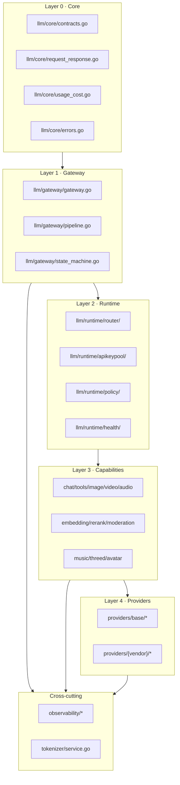
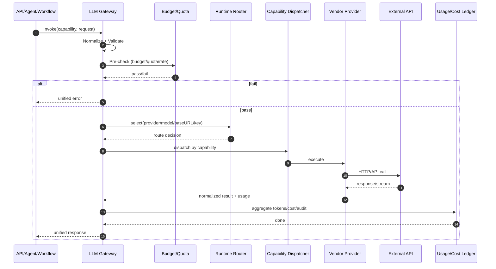

# LLM 层重构执行文档（单轨替换，非兼容）

> 文档类型：可执行重构规范  
> 适用范围：`llm/` 全域（Provider、能力模块、路由、可观测、预算与 Token）  
> 迁移策略：不兼容旧实现，不保留双轨

---

## 0. 执行状态总览

- [x] 完成当前 LLM 实现全量盘点（目录、模块、供应商、能力矩阵）
- [x] 完成目标目录骨架落地（`llm/core + llm/gateway + llm/runtime + llm/capabilities + llm/providers/base`）
- [x] 完成统一入口 `Gateway` 与统一请求状态机落地
- [x] 完成所有 LLM 供应商迁移到新 Provider 抽象
- [x] 完成所有多模态能力迁移到统一 Capability 抽象
- [x] 完成 Token/Cost 统一口径（入口预估 + 出口记账）
- [x] 删除旧路径与并行实现（Factory/Wrapper/Capability 并行入口）
- [x] 完成全链路回归测试与架构守卫

---

## 1. 重构目标（必须同时满足）

### 1.1 业务目标

- 单一入口：所有 LLM 与多模态调用必须从统一网关进入。
- 单一实现：同一能力只允许一个主路径，不允许新旧并存。
- 单一统计口径：Token/Cost 统计只能在统一入口和统一出口处理。
- 单一供应商模型：所有供应商能力通过统一 Provider/Capability 抽象承载。

### 1.2 技术目标

- 消除并行入口（`router_multi_provider + provider_wrapper + 各能力独立工厂 + handler 手工拼装`）。
- 将 “能力维度分包” 与 “供应商维度分包” 收敛到统一层次。
- 保持 `types/` 零依赖，不把供应商细节回灌到 `types`。

---

## 2. 当前实现全量盘点（已确认）

## 2.1 `llm/` 当前模块

当前 `llm/` 目录包含以下模块（不含测试文件）：

- `batch`
- `budget`
- `cache`
- `circuitbreaker`
- `config`
- `embedding`
- `factory`
- `idempotency`
- `image`
- `middleware`
- `moderation`
- `multimodal`
- `music`
- `observability`
- `providers`
- `rerank`
- `retry`
- `router`
- `speech`
- `streaming`
- `threed`
- `tokenizer`
- `tools`
- `video`

> 进展更新（2026-03-02）：`budget/retry/router` 旧目录已完成迁移，当前对应为 `runtime/policy` 与 `runtime/router`。

问题结论：

- 存在“按能力分包”和“按供应商分包”双体系并行。
- 存在多个 Provider 构造入口，导致配置、策略、观测点分散。

## 2.2 LLM 对话供应商（Chat Provider）全量清单

| 供应商代码 | 目录 | 实现方式 | 默认 BaseURL | 默认回退模型/默认模型 |
|---|---|---|---|---|
| `openai` | `llm/providers/openai` | OpenAI 专用实现 + `openaicompat` | `https://api.openai.com` | `gpt-5.2` |
| `claude` (`anthropic`) | `llm/providers/anthropic` | Claude 原生实现 | `https://api.anthropic.com` | `claude-opus-4.5-20260105` |
| `gemini` | `llm/providers/gemini` | Gemini 原生实现 | `https://generativelanguage.googleapis.com`（Vertex 模式按 region） | `gemini-2.5-flash` |
| `deepseek` | `llm/providers/vendor + llm/providers/openaicompat` | compat chat profile（chat 目录已删除） | `https://api.deepseek.com` | `deepseek-chat` |
| `qwen` | `llm/providers/vendor + llm/providers/openaicompat` | compat chat profile；能力实现保留在 `llm/providers/qwen` | `https://dashscope.aliyuncs.com` | `qwen3-235b-a22b` |
| `glm` | `llm/providers/vendor + llm/providers/openaicompat` | compat chat profile；能力实现保留在 `llm/providers/glm` | `https://open.bigmodel.cn` | `glm-4-plus` |
| `grok` | `llm/providers/vendor + llm/providers/openaicompat` | compat chat profile；能力实现保留在 `llm/providers/grok` | `https://api.x.ai` | `grok-3` |
| `doubao` | `llm/providers/vendor + llm/providers/openaicompat` | compat chat profile；能力实现保留在 `llm/providers/doubao`（含 signer/context cache） | `https://ark.cn-beijing.volces.com` | `Doubao-1.5-pro-32k` |
| `kimi` | `llm/providers/vendor + llm/providers/openaicompat` | compat chat profile（chat 目录已删除） | `https://api.moonshot.cn` | `moonshot-v1-32k` |
| `mistral` | `llm/providers/vendor + llm/providers/openaicompat` | compat chat profile；能力实现保留在 `llm/providers/mistral` | `https://api.mistral.ai` | `mistral-large-latest` |
| `hunyuan` | `llm/providers/vendor + llm/providers/openaicompat` | compat chat profile（chat 目录已删除） | `https://api.hunyuan.cloud.tencent.com` | `hunyuan-turbos-latest` |
| `minimax` | `llm/providers/vendor + llm/providers/openaicompat` | compat chat profile；能力实现保留在 `llm/providers/minimax` | `https://api.minimax.io` | `MiniMax-Text-01` |
| `llama-*` | `llm/providers/vendor + llm/providers/openaicompat` | compat chat profile（chat 目录已删除） | `https://api.together.xyz` / `https://api.replicate.com` / `https://openrouter.ai/api` | `meta-llama/Llama-3.3-70B-Instruct-Turbo` |
| `openaicompat` | `llm/providers/openaicompat` | 通用 OpenAI-Compatible 基座 | 由配置注入 | 由配置注入 |

## 2.3 多模态能力矩阵（13 个 LLM 供应商）

> 口径：以下为“代码已实现能力矩阵（Implemented Matrix）”，由 `llm/providers/capability_matrix.go` 声明并通过 `pwsh -NoProfile -File scripts/gen_llm_matrix.ps1` 生成（产物：`docs/generated/llm-implemented-matrix.md`）。
> 维护要求：修改任一 provider 能力实现时，必须在同一提交同步更新 `llm/providers/capability_matrix.go` 并重新生成矩阵文档，禁止手工直接改表格内容。

| Provider | 图像 | 视频 | 音频生成 | 音频转录 | Embedding | 微调 |
|---|---|---|---|---|---|---|
| OpenAI | ✅ | ❌ | ✅ | ✅ | ✅ | ✅ |
| Claude | ❌ | ❌ | ❌ | ❌ | ❌ | ❌ |
| Gemini | ✅ | ✅ | ✅ | ❌ | ✅ | ❌ |
| DeepSeek | ❌ | ❌ | ❌ | ❌ | ❌ | ❌ |
| Qwen | ✅ | ❌ | ✅ | ❌ | ✅ | ❌ |
| GLM | ✅ | ✅ | ❌ | ❌ | ✅ | ❌ |
| Grok | ✅ | ❌ | ❌ | ❌ | ✅ | ❌ |
| Doubao | ✅ | ❌ | ✅ | ❌ | ✅ | ❌ |
| Kimi | ❌ | ❌ | ❌ | ❌ | ❌ | ❌ |
| Mistral | ❌ | ❌ | ❌ | ✅ | ✅ | ❌ |
| Hunyuan | ❌ | ❌ | ❌ | ❌ | ❌ | ❌ |
| MiniMax | ❌ | ❌ | ✅ | ❌ | ❌ | ❌ |
| Llama | ❌ | ❌ | ❌ | ❌ | ❌ | ❌ |

## 2.4 能力模块供应商全量清单（非 Chat）

### Embedding

- `openai` / `cohere` / `voyage` / `jina` / `gemini`

### Image

- `openai` / `flux` / `gemini`
- 备注：`Stability/Imagen4` 在配置层存在，但当前 factory 主入口未统一接通。

### Rerank

- `cohere` / `voyage` / `jina`

### Speech（TTS/STT）

- TTS：`openai` / `elevenlabs`
- STT：`openai` / `deepgram`

### Video

- `gemini-video` / `veo` / `runway` / `sora` / `kling` / `luma` / `minimax-video`

### Music

- `suno` / `minimax`

### 3D

- `meshy` / `tripo`

### Moderation

- `openai`

### Tools（Web Search / Scrape 供应商）

- 搜索：`duckduckgo` / `tavily` / `searxng` / `firecrawl`
- 抓取：`http` / `jina` / `firecrawl`

---

## 3. 当前架构问题（重构输入）

- [x] 多入口问题：Provider 构造、路由、能力工厂、handler 装配并存。
- [x] 多口径问题：Token/Cost 在 `provider`、`providers/common`、`observability`、能力包里分散。
- [x] 多层重复问题：同一供应商配置在 Chat/Embedding/Image/Video/TTS 等多处重复。
- [x] 扩展成本高：新增供应商通常需要改多包和多入口。
- [x] 删除困难：旧实现和新实现并行会导致收敛风险。

---

## 4. 目标架构（重构后唯一目录）

```text
llm/
├── core/
│   ├── contracts.go
│   ├── request_response.go
│   ├── usage_cost.go
│   └── errors.go
├── gateway/
│   ├── gateway.go
│   ├── pipeline.go
│   └── state_machine.go
├── runtime/
│   ├── router/
│   ├── apikeypool/
│   ├── policy/
│   └── health/
├── capabilities/
│   ├── chat/
│   ├── tools/
│   ├── image/
│   ├── video/
│   ├── audio/
│   ├── embedding/
│   ├── rerank/
│   ├── moderation/
│   ├── music/
│   ├── threed/
│   └── avatar/
├── providers/
│   ├── base/
│   │   ├── http_client.go
│   │   ├── openai_compat.go
│   │   ├── error_mapping.go
│   │   └── capability_adapter.go
│   ├── openai/
│   ├── anthropic/
│   ├── gemini/
│   ├── deepseek/
│   └── ... (其它供应商)
├── observability/
│   ├── metrics.go
│   ├── tracing.go
│   ├── audit.go
│   └── ledger.go
└── tokenizer/
    └── service.go
```

## 4.1 分层图（目录分层）



## 4.2 调用时序图（统一入口）



---

## 5. 统一状态机（请求级）

`Planned -> Validated -> Routed -> Executing -> (Streaming|Completed|Failed) -> (Retried/Degraded) -> Completed`

状态约束：

- `Validated` 前不允许路由。
- `Routed` 后必须携带 `{provider, model, base_url, api_key_ref}`。
- `Executing` 阶段禁止改写路由决策。
- `Completed` 前必须完成 usage/cost 归档。

---

## 6. 统一接口设计（目标态）

## 6.1 单一入口接口

```go
type Gateway interface {
    Invoke(ctx context.Context, req *UnifiedRequest) (*UnifiedResponse, error)
    Stream(ctx context.Context, req *UnifiedRequest) (<-chan UnifiedChunk, error)
}
```

## 6.2 统一请求结构（抽象）

- `Capability`：`chat/tools/image/video/audio/embedding/rerank/moderation/music/threed/avatar`
- `ProviderHint`（可选）
- `ModelHint`（可选）
- `RoutePolicy`（成本优先/健康优先/延迟优先等）
- `Payload`（按 capability 解释）

## 6.3 统一出口结构（抽象）

- `Output`
- `Usage`（统一 TokenUsage）
- `Cost`
- `TraceID`
- `ProviderDecision`

## 6.4 主模型 / 工具模型路由语义（双模型）

- 单入口不等于单模型：所有请求仍经 `Gateway`，但允许按调用阶段选择不同模型。
- `primary` 路由：最终内容生成（assistant final response）。
- `tool` 路由：工具调用/函数调用/ReAct 循环。
- 回退规则：未配置 `tool` 路由时，自动回退 `primary`。
- 观测要求：`provider/model` 统计需按 `route_role=primary|tool` 分维度输出。

---

## 7. 执行计划（带 `[ ]` 可执行状态）

## 7.1 Phase-0：重构准备

- [x] 冻结 `llm/` 新功能开发窗口（仅允许重构相关 PR）
- [x] 建立 `llm` 重构分支与合并策略
- [x] 建立重构期间每日状态更新机制（本文件作为唯一状态源）

## 7.2 Phase-1：核心骨架落地

- [x] 新建 `llm/core` 并迁移统一契约（不保留旧副本）
- [x] 新建 `llm/gateway` 并实现唯一入口
- [x] 新建 `llm/runtime/router`，接管旧 `router_multi_provider` 主职责
- [x] 新建 `llm/runtime/policy`，收敛预算/限流/重试策略

## 7.3 Phase-2：Provider 层重构

- [x] 新建 `llm/providers/base` 并承载 HTTP/OpenAI-Compat/ErrorMap 公共逻辑
- [x] 将 14 个 Chat 供应商逐个迁移到新 Provider 抽象
- [x] 统一 API Key 轮询与凭据覆盖语义
- [x] 清理 provider 层重复类型定义

## 7.4 Phase-3：能力层重构

- [x] 建立 `llm/capabilities/*` 统一能力入口
- [x] 迁移 `image/video/speech/embedding/rerank/moderation/music/threed/tools`
- [x] 引入 `avatar` 能力槽位（接口先行）
- [x] 让 capability 只依赖 gateway/runtime/provider，不直接依赖 handler

## 7.5 Phase-4：Token/Cost/观测收敛

- [x] 入口统一做 token 预算预估
- [x] 出口统一做 usage 归一化
- [x] 出口统一做 cost 计算与 ledger 落账
- [x] 统一流式与非流式统计口径

## 7.6 Phase-5：删除旧实现（必须执行）

- [x] 删除旧并行工厂入口
- [x] 删除旧 wrapper 并行入口
- [x] 删除 capability 侧重复构造路径
- [x] 删除 handler 侧供应商手工拼装
- [x] 删除废弃配置项与废弃文档片段

## 7.7 Phase-6：验收与发布

- [x] 单元测试通过（provider/capability/gateway/runtime）
- [x] 集成测试通过（chat + multimodal + tools）
- [x] 架构守卫通过（依赖方向/入口约束）
- [x] 文档更新完成（README/教程/API）
- [x] 发布版本并记录变更摘要

---

## 8. 供应商迁移状态（逐个执行）

### 8.1 Chat 供应商

- [x] openai
- [x] claude (anthropic)
- [x] gemini
- [x] deepseek
- [x] qwen
- [x] glm
- [x] grok
- [x] doubao
- [x] kimi
- [x] mistral
- [x] hunyuan
- [x] minimax
- [x] llama
- [x] openaicompat (generic)

### 8.2 能力供应商

- [x] embedding: openai/cohere/voyage/jina/gemini
- [x] image: openai/flux/gemini
- [x] rerank: cohere/voyage/jina
- [x] speech: openai/elevenlabs/deepgram
- [x] video: gemini/veo/runway/sora/kling/luma/minimax-video
- [x] music: suno/minimax
- [x] threed: meshy/tripo
- [x] moderation: openai
- [x] tools: duckduckgo/tavily/searxng/firecrawl/http/jina

---

## 9. 完成定义（DoD）

以下全部完成才允许标记“重构完成”：

- [x] 外部调用只经过 `Gateway` 单入口
- [x] 无并行旧路径残留
- [x] 所有供应商在新架构下可用并通过回归
- [x] 所有能力模块完成迁移并通过回归
- [x] Token/Cost 统计口径统一且一致
- [x] 文档、测试、守卫规则同步更新

---

## 10. 变更日志

- [x] 2026-03-02：创建文档，完成当前实现盘点、供应商全量清单、目标架构图与执行清单初始化。
- [x] 2026-03-02：完成 `llm/core` 与 `llm/gateway` 初版落地；`api/handlers/chat.go` 与 `api/handlers/multimodal.go` 已切换到 gateway 单入口（chat/image/video + multimodal chat/agent-mode），并在 gateway 出口统一汇总 usage/cost（已接入 chat/image/video）。
- [x] 2026-03-02：完成 `llm/runtime/router` 迁移：`router_multi_provider/apikey_pool/health_monitor/router_types` 已从 `llm/` 根目录迁移至 `llm/runtime/router`，并通过 `go test ./...` 与 `scripts/arch_guard.ps1`。
- [x] 2026-03-02：完成 `llm/runtime/policy` 落地：`llm/budget` 与 `llm/retry` 已并入 `llm/runtime/policy`，`llm/resilience` 与 `cmd/agentflow` 已切换到新策略层，`gateway` 已接入 policy pre-check/usage record，旧目录 `llm/budget` 与 `llm/retry` 已删除。
- [x] 2026-03-02：完成 `llm/providers/base` 公共层迁移：`openai_compat/error_mapping/capability_adapter/multimodal_helpers` 公共逻辑已集中到 `llm/providers/base`；`llm/providers/*` 与 `llm/capabilities/moderation` 已切换为 `providerbase` 调用；旧 `llm/providers/common.go`、`llm/providers/base_capability.go`、`llm/providers/multimodal_helpers.go` 及对应旧测试入口已删除/迁移；通过 `go test ./llm/providers/...`、`go test ./llm/capabilities/moderation/...`、`go test ./llm/...`、`go test ./...` 与 `scripts/arch_guard.ps1`。
- [x] 2026-03-02：完成 Provider API Key 语义统一：`openaicompat.Provider` 新增 `ResolveAPIKey/ApplyHeaders` 公共入口，`HealthCheck/ListModels`、OpenAI Responses API、以及各供应商 multimodal/context cache 路径统一使用“context override -> APIKeys 轮询 -> 单 Key”语义；新增对应测试覆盖（含 `HealthCheck/ListModels`）；通过 `go test ./llm/providers/...`、`go test ./llm/...` 与 `scripts/arch_guard.ps1`。
- [x] 2026-03-02：完成 provider 层公共类型去重：`OpenAICompat*`、`StreamOptions`、`Thinking`、`WebSearchOptions` 等类型统一收敛至 `llm/providers/base/openai_compat.go`；provider 侧不再保留并行重复定义入口。
- [x] 2026-03-02：完成能力层统一入口（Phase-3 第1项）：新增 `llm/capabilities/entry.go` 作为能力聚合入口，封装 `multimodal.Router` 并提供统一 image/video 调用面；`llm/gateway` 已从直接依赖 `multimodal.Router` 切换为依赖 `capabilities.Entry`；`api/handlers/multimodal.go` 已按新入口接线；通过 `go test ./llm/capabilities/...`、`go test ./llm/gateway/...`、`go test ./api/handlers/...`。
- [x] 2026-03-02：完成能力层迁移（Phase-3 第2项）：`llm/capabilities/entry.go` 已补齐 `tools/audio/embedding/rerank/moderation/music/threed` 统一入口（含 `ToolExecutor` 执行面），`llm/gateway/gateway.go` 已补齐对应 capability payload 与 `invoke` 分发分支，统一输出 `UnifiedResponse`（usage/cost/providerDecision）；新增 `llm/gateway/gateway_capabilities_test.go` 与扩展 `llm/capabilities/entry_test.go` 覆盖多能力调用路径。
- [x] 2026-03-02：完成 `avatar` 能力槽位（Phase-3 第3项，接口先行）：新增 `llm/capabilities/avatar/types.go` 定义统一 Provider/Request/Response；`llm/capabilities/entry.go` 增加 avatar 注册与调用入口（`RegisterAvatar/Avatar/GenerateAvatar`）；`llm/gateway/gateway.go` 增加 `CapabilityAvatar` 分支与 `AvatarInput`/`invokeAvatar`。
- [x] 2026-03-02：完成 Phase-3 第4项依赖约束审计：`llm/capabilities` 已无 `api/handlers` 依赖（通过仓库级搜索校验），能力层对外统一经 `gateway` 入口消费，不再存在 handler 直接耦合。
- [x] 2026-03-02：完成 Phase-4 第1项（入口统一 token 预算预估）：`llm/gateway/gateway.go` 在 `preflightPolicy` 中新增统一 token 预算预检链路；当前 chat 能力优先且仅使用原生 `llm.TokenCountProvider`，并在成功时回填 `metadata.estimated_tokens`；新增 `llm/gateway/gateway_policy_estimation_test.go` 验证预算拦截与 metadata 覆盖语义。
- [x] 2026-03-02：完成 Phase-4 第2项（出口 usage 归一化）：`llm/gateway/gateway.go` 新增 `normalizeUsage` 统一归一化函数，并在 `Invoke` 出口与 `Stream` chunk 出口统一执行（补齐 `TotalTokens/TotalUnits` 缺失值并清洗负值）；新增 `llm/gateway/gateway_usage_normalization_test.go` 覆盖同步与流式归一化路径。
- [x] 2026-03-02：完成 Phase-4 第3项（出口 cost 计算与 ledger 落账）：新增 `llm/observability/ledger.go` 定义统一 `Ledger` 接口与默认 no-op 实现；`llm/gateway/gateway.go` 在 `Invoke` 与 `Stream` 出口统一执行 `normalizeCost` 并落账，记录 `{trace/capability/provider/model/usage/cost/metadata}`；新增 `llm/gateway/gateway_ledger_test.go` 覆盖同步/流式落账与无 ledger 配置路径。
- [x] 2026-03-02：完成 Phase-4 第4项（统一流式与非流式统计口径）：`llm/gateway/gateway.go` 的 `Stream` 已改为“按流结束时最后 usage 一次性记账/落账”，不再按 chunk 重复累计；新增 `TestService_Stream_RecordsUsageOnceWithFinalChunk` 验证流式仅记一次且取最终 usage。
- [x] 2026-03-02：完成 Phase-5 第1项（删除旧并行工厂入口）：新增 `llm/providers/vendor/chat_factory.go` 作为 chat provider 唯一配置构造入口（`NewChatProviderFromConfig`），`cmd/agentflow/server_handlers_runtime.go` 与 `agentflow.go` 已切换到新入口；旧 `llm/factory/*` 目录已删除。
- [x] 2026-03-02：完成 Phase-5 第2项（删除旧 wrapper 并行入口）：删除 `llm/provider_wrapper.go` 及其测试，`llm/runtime/router` 已内聚本包 `provider_factory.go`，不再依赖 `llm` 根层 wrapper 工厂。
- [x] 2026-03-02：完成 Phase-5 第3项（删除 capability 侧重复构造路径）：删除未被调用的 `llm/providers/vendor/capability_factory.go`（避免 capability 工厂二次封装并行入口）；`rag/factory.go` 的 rerank 构造已统一切换到 `llm/capabilities/rerank.NewProviderFromConfig`，不再直连 `NewCohereProvider/NewVoyageProvider/NewJinaProvider`。
- [x] 2026-03-02：完成 Phase-5 第4项（删除 handler 侧供应商手工拼装）：新增 `llm/capabilities/multimodal/provider_builder.go` 统一承接 image/video provider 组装；`api/handlers/multimodal.go` 的 `NewMultimodalHandlerFromConfig` 已切换为调用 `multimodal.BuildProvidersFromConfig`，不再直接构造 `video.New*Provider`。
- [x] 2026-03-02：完成 Phase-5 第5项（删除废弃配置项与废弃文档片段）：清理旧 API 文档示例中已移除入口（`llm.NewDefaultProviderFactory`、`llm.NewMultiProviderRouter`、`llm.NewAPIKeyPool` 等），统一更新到 `llm/runtime/router` 新路径；同步修正 `CONTRIBUTING.md` 中 embedding 工厂路径为 `llm/capabilities/embedding/factory.go`。
- [x] 2026-03-02：完成 Phase-6 验收（除发布外）：通过 `go test ./llm/providers/... ./llm/capabilities/... ./llm/gateway/... ./llm/runtime/...`、`go test ./api/handlers/... ./llm/capabilities/tools/... ./llm/gateway/...`、`go test ./...` 与 `scripts/arch_guard.ps1`；并完成 README/教程相关旧入口文档更新。
- [x] 2026-03-02：完成 Phase-6 发布记录：发布摘要为“LLM 单轨重构完成并切换唯一入口（Gateway/Runtime Router/Capabilities）”；能力供应商矩阵（embedding/image/rerank/speech/video/music/threed/moderation/tools）全部在新架构登记为完成；复核通过 `go test ./...` 与 `pwsh -NoProfile -File scripts/arch_guard.ps1`（guard 仅保留非阻断 warning，状态为 passed）。
- [x] 2026-03-02：回填 Phase-0 流程状态：已执行重构冻结窗口、分支策略与“本文档作为唯一状态源”的日更机制，后续阶段均按该状态源推进与验收。
- [x] 2026-03-02：补充双模型路由语义：在 Gateway 单入口下区分 `primary/tool` 调用阶段，并定义缺省回退与观测维度。
- [x] 2026-03-02：修复 2.3 能力矩阵与代码实现不一致项（Qwen 图像、Grok 图像、Grok Embedding、Doubao 图像、Mistral 音频转录）；新增 `llm/providers/capability_matrix.go` 作为矩阵声明源，并新增 `scripts/gen_llm_matrix.ps1` 自动生成 `docs/generated/llm-implemented-matrix.md`，用于防止后续文档漂移。
- [x] 2026-04-17：完成边界收口补丁第 1 项：删除 `llm -> rag` 反向依赖，移除 `llm/capabilities/embedding/rag_adapter.go`、`llm/capabilities/rerank/rag_adapter.go`、`llm/tokenizer/rag_adapter.go`，并在 `rag/` 根包新增 `LLMEmbeddingProviderAdapter`、`LLMRerankProviderAdapter`、`LLMTokenizerAdapter` 单向桥接实现。
- [x] 2026-04-17：完成边界收口补丁第 2 项：将 main provider 启动注册/装配从 `llm/runtime/compose` 迁移到 `internal/app/bootstrap/main_provider_registry.go`；`llm/runtime/compose` 仅保留纯 runtime 组装，不再依赖 `config` / `gorm`。
- [x] 2026-04-17：完成边界守卫补强：`architecture_guard_test.go` 新增 `llm -> rag` 禁止依赖规则与 `TestLLMComposeImportGuards`；`scripts/arch_guard.ps1` 同步校验 `llm/runtime/compose` 不得引入 `config/gorm`，并将 vendor-factory 入口守卫切换到 `internal/app/bootstrap/main_provider_registry.go`。
